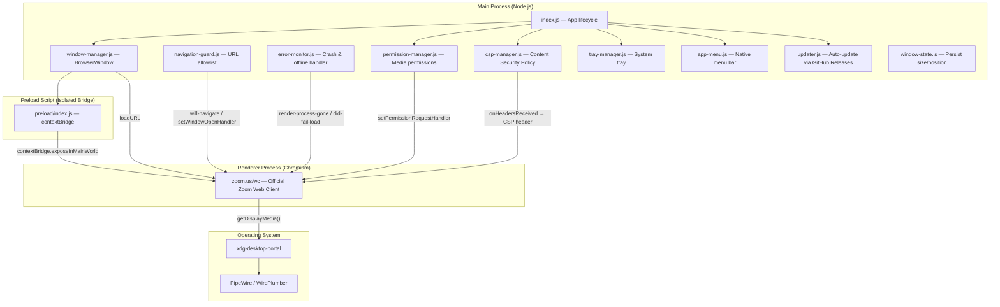
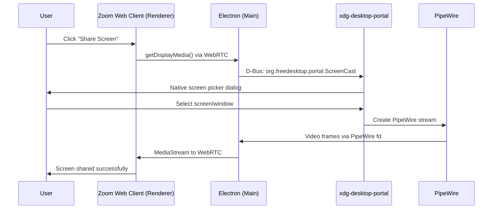

# Architecture

This document describes the internal structure of Zoom Linux Native: how the
processes communicate, where the security boundaries sit, and the reasoning behind
every major technical decision.

---

## Process Model

Zoom Linux Native follows Electron's multi-process architecture with strict
isolation between the main (Node.js) process and the renderer (Chromium) process.



## Data Flow: Screen Sharing

This is the core differentiator of the project. The native Zoom client (Qt) has its
own screen capture implementation that crashes on Wayland. This app sidesteps that
entirely by delegating to Chromium's proven pipeline:



## Security Layers

The app enforces a defense-in-depth posture. Every layer is independent — even if
one fails, the others hold:

| Layer | Mechanism | File |
|---|---|---|
| **Process isolation** | `contextIsolation: true`, `nodeIntegration: false`, `sandbox: true` | `window-manager.js` |
| **Disabled dangerous APIs** | `webviewTag: false`, `navigateOnDragDrop: false`, `disableBlinkFeatures: 'Auxclick'` | `window-manager.js` |
| **Navigation restriction** | All navigation gated by a central allowlist (`zoom.us`, `zoom.com`) | `navigation-guard.js`, `allowed-origins.js` |
| **Permission control** | Camera/mic auto-approved only for `zoom.us` origin; all else denied | `permission-manager.js` |
| **Content Security Policy** | CSP headers injected on every response via `onHeadersReceived` | `csp-manager.js` |
| **Preload boundary** | Only `app:reload` exposed via `contextBridge`; no raw `ipcRenderer` leak | `preload/index.js` |

## Directory Structure

```
zoom-linux-native/
├── build/                      # App icons and build assets
│   └── icon.png
├── src/
│   ├── main/                   # Main process (Node.js)
│   │   ├── index.js            # Entry point, app lifecycle
│   │   ├── window-manager.js   # BrowserWindow creation and state
│   │   ├── window-state.js     # Persist/restore window bounds
│   │   ├── permission-manager.js  # Media permission handlers
│   │   ├── error-monitor.js    # Crash recovery, offline fallback
│   │   ├── css-injector.js     # Local CSS overrides (presentation only)
│   │   ├── tray-manager.js     # System tray icon + context menu
│   │   ├── app-menu.js         # Native application menu bar
│   │   ├── single-instance.js  # Prevent duplicate instances
│   │   ├── updater.js          # Auto-update via electron-updater
│   │   ├── assets/
│   │   │   └── offline.html    # Offline fallback page
│   │   ├── config/
│   │   │   ├── constants.js    # App-wide constants (URLs, sizes)
│   │   │   └── allowed-origins.js  # Navigation allowlist
│   │   └── security/
│   │       ├── navigation-guard.js  # URL interception logic
│   │       └── csp-manager.js       # CSP header injection
│   └── preload/
│       └── index.js            # contextBridge — minimal exposed API
├── package.json
├── README.md
└── ARCHITECTURE.md             # This file
```

---

## Technical Decisions

### Why Electron (and not Tauri, nwjs, or a native app)?

**The entire point of this project is Chromium's WebRTC + PipeWire pipeline.** That
pipeline is what makes screen sharing work on Wayland without crashes. Electron
embeds Chromium, so we get that pipeline for free — it's the same one Google Chrome,
Brave, Vivaldi, and every other Chromium-based browser uses for `getDisplayMedia()`.

Tauri uses the system webview (WebKitGTK on Linux), which has a completely different
— and less mature — WebRTC implementation. We would be trading a known-good pipeline
for an uncertain one, which defeats the purpose.

A fully native app (GTK, Qt) would mean reimplementing screen capture from scratch,
which is exactly the problem Zoom's own native client has.

### Why the Web Client (and not the Zoom Meeting SDK)?

The Zoom Meeting SDK requires a paid plan, API credentials, and adds complexity for
a wrapper project that exists to solve a specific driver-level bug. The Web Client
at `zoom.us/wc` is free, maintained by Zoom, and already handles all meeting logic.
This project is a *shell* around that existing, working interface — not a new client.

### Why inject CSS instead of modifying the page?

The `css-injector.js` module uses `webContents.insertCSS()` to apply *presentation-
only* overrides. This is the same mechanism browser extensions like Dark Reader use.
We never touch the DOM, never inject JavaScript into the page, and never intercept
or modify Zoom's application logic. The distinction matters legally and ethically:
we are adjusting how the page *looks* in our window, not what it *does*.

### Why `minWidth: 1100` instead of CSS overrides for the chat panel?

The Zoom Web Client uses standard responsive breakpoints to hide the chat panel in
narrow viewports. Rather than fighting the page's CSS (which Zoom can change at any
time), we enforce a minimum window width that guarantees the viewport never hits that
breakpoint. This is a zero-maintenance solution: it doesn't depend on Zoom's class
names, selectors, or layout implementation — just the observable fact that the chat
panel is visible at 1100px and hidden below some threshold.

Tested: 2026-08-10. The chat panel remains visible at 1100px on the current Zoom
Web Client. If Zoom changes their breakpoints, the only fix needed is adjusting a
single constant in `config/constants.js`.

### Why auto-approve camera/mic permissions only for zoom.us?

Electron's default behavior for permission requests is to silently deny them. For a
video conferencing app, that means camera and microphone never work unless we
explicitly approve them. We auto-approve `media` permissions, but *only* when the
requesting origin is `zoom.us` — the handler checks the origin on every request.
Any other origin or any non-media permission is denied by default.

### Why not enable `nodeIntegration`?

The renderer loads `zoom.us` — a third-party website we do not control. If
`nodeIntegration` were `true`, any XSS vulnerability in Zoom's web client would
give an attacker full access to the user's filesystem via Node.js APIs. This is a
textbook Remote Code Execution (RCE) vector. `nodeIntegration: false` +
`contextIsolation: true` + `sandbox: true` is the mandatory baseline for any
Electron app loading remote content.
