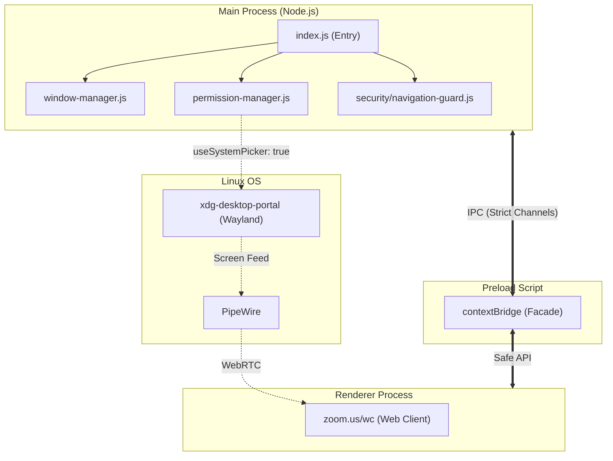

# Zoom Linux Native

> An unofficial Electron shell around the Zoom Web Client, built as a resilience layer
> for the post-X11 era on Linux.

**Not affiliated with, endorsed by, or sponsored by Zoom Video Communications, Inc.**
This project loads the official `zoom.us/wc` web client inside a controlled desktop
window — it does not modify, reverse-engineer, or redistribute any of Zoom's
proprietary code.

---

## The problem this project exists to solve

Zoom's official Linux desktop client (built with Qt) has a long-standing, still
unresolved bug: it crashes when starting or stopping screen sharing on **Wayland +
PipeWire** sessions. The most common workaround the community has landed on is
forcing an X11/XWayland session instead of Wayland.

That workaround already has an expiration date, and for the largest Linux desktop
environment, the expiration already happened. **GNOME 50**, released March 18, 2026,
completely removed the X11 session backend from Mutter, GNOME Shell, and GDM. That's
not a future risk — it's already shipping in **Ubuntu 26.04 LTS** and
**Fedora Workstation 44**, both released in April 2026: there is no "GNOME on Xorg"
option left at the login screen on a clean install of either. The only escape hatch is
staying on an older LTS (Ubuntu 24.04 keeps GNOME-on-X11 until its 2029 end of life)
or switching to a different desktop environment entirely.

**KDE Plasma** is a few months behind but on the same track: the Plasma X11 session
will be removed starting with **Plasma 6.8**, expected around October 2026, with
residual support for the X11 session continuing only until "early 2027" according to
the KDE project. When X11 stops being available by default on a given desktop
environment, the fallback that currently keeps the native Zoom client usable on Linux
disappears with it.

This project exists so that access to Zoom on Linux doesn't depend on X11 sticking
around. Instead of relying on Zoom's native Qt integration with Wayland/PipeWire
(where the bug lives), it runs the Zoom Web Client inside Electron's Chromium engine,
which already has a mature, well-tested WebRTC + PipeWire screen-capture pipeline —
the same one every Chromium-based browser uses for any website that shares your
screen.

## Why not just open zoom.us/wc in a browser tab, then?

You can, and for many people that's a perfectly reasonable answer. This project adds
value on top of "just use the browser" in two ways:

1. **Desktop integration** a plain browser tab doesn't give you: a system tray icon,
   native notifications, a dedicated persistent window, and window management that
   behaves like an installed app instead of a tab you can accidentally close.
2. **Active mitigation of known Web Client UX regressions**, instead of shipping them
   as-is. The Zoom Web Client has real, documented gaps compared to the native
   client — most notably a chat panel that can collapse in narrow windows due to the
   page's responsive breakpoints, and intermittent screen-share viewing issues. This
   project's window sizing and error-handling layer specifically targets those
   regressions (see [Known limitations](#known-limitations-and-trade-offs) below) —
   it is not meant to be a naive 1:1 wrapper of the raw page.

## How it works, at a glance



Screen sharing flows through the OS-native `xdg-desktop-portal`/PipeWire pipeline.
The app enables Chromium's `WebRTCPipeWireCapturer` flag, which causes
`getDisplayMedia()` calls to route through PipeWire automatically — triggering the
system's native screen picker on Wayland, or using X11's capture path on X11. This is
the same pipeline every Chromium-based browser uses for stable screen sharing.

Full architecture documentation, Mermaid diagrams, and technical decision rationale
live in [`ARCHITECTURE.md`](./ARCHITECTURE.md). Security rules and non-negotiable
constraints live in [`GEMINI.md`](./GEMINI.md). The build roadmap lives in
[`TASK_PLAN.md`](./TASK_PLAN.md).

## Demo

> **TODO:** Add a GIF or short video showing the app running on a GNOME Wayland
> session — screen sharing starting and stopping without crashes. This is the
> strongest visual argument for the project.
>
> Suggested recording: before (native client crash) vs. after (this app, stable).

## Installation

### Flatpak (recommended)

The Flatpak build includes all dependencies and runs sandboxed. To build and install
locally:

```bash
# 1. Build the Electron app
npm ci
npm run build:linux -- --dir

# 2. Build and install the Flatpak
cd flatpak
flatpak-builder --force-clean --user --install build-dir dev.joaopedroferraz.zoomlinuxnative.yml

# 3. Run
flatpak run dev.joaopedroferraz.zoomlinuxnative
```

> **Note:** You need `flatpak-builder` installed on your system. On Ubuntu/Debian:
> `sudo apt install flatpak-builder`. On Fedora: `sudo dnf install flatpak-builder`.

### AppImage

Download the `.AppImage` from the
[Releases](https://github.com/jpferraz-git/zoom-linux-native/releases) page, make it
executable, and run:

```bash
chmod +x Zoom-Linux-Native-*.AppImage
./Zoom-Linux-Native-*.AppImage
```

### .deb / .rpm

Download the appropriate package from
[Releases](https://github.com/jpferraz-git/zoom-linux-native/releases) and install:

```bash
# Debian/Ubuntu
sudo dpkg -i zoom-linux-native_*.deb

# Fedora/RHEL
sudo rpm -i zoom-linux-native-*.rpm
```

## Getting started (development)

### Prerequisites

- **Node.js 18+** and npm
- **Linux** (Wayland or X11 — the app auto-detects via `ozone-platform-hint=auto`)

#### System dependencies for screen sharing (Wayland)

Screen sharing on Wayland requires the OS to provide a portal and a PipeWire-based
capture pipeline. These are **not installed by this app** — they are part of the
operating system's display infrastructure:

| Package | Purpose | Notes |
|---|---|---|
| `xdg-desktop-portal` | D-Bus portal daemon | Handles screen capture requests from sandboxed apps |
| `xdg-desktop-portal-gnome` | GNOME backend | For GNOME desktop environment |
| `xdg-desktop-portal-kde` | KDE backend | For KDE Plasma |
| `xdg-desktop-portal-wlr` | wlroots backend | For Sway, Hyprland, and other wlroots compositors |
| `pipewire` + `wireplumber` | Media pipeline | Usually pre-installed on modern distros (Ubuntu 22.04+, Fedora 34+) |

> **Note:** On most modern distros (Ubuntu 22.04+, Fedora 34+, Arch), these packages
> are already installed and running by default. If screen sharing doesn't show a
> picker dialog, verify your portal backend is installed and running:
> `systemctl --user status xdg-desktop-portal`

On **X11** sessions, screen sharing works without these dependencies — Chromium
uses its native X11 capture path directly.

### Run in development

```bash
npm install
npm start
```

If you're specifically testing Wayland behavior, you can force the Ozone platform
hint explicitly:

```bash
npm run start:wayland
```

### Build installers

```bash
npm run build:linux   # AppImage + .deb + .rpm
```

Artifacts land in `dist/`.

### Run tests

```bash
npm test
```

Unit tests cover the security-critical modules: navigation allowlist, permission
manager, deep link handler, and navigation guard.

## Known limitations and trade-offs

This project is upfront about what it does *not* fix, because that honesty is part of
what makes it trustworthy as more than a demo:

| Capability | Native client (with X11 workaround) | This app | Notes |
|---|---|---|---|
| Screen share (start/stop) on Wayland | ❌ Crashes | ✅ Stable | Chromium's WebRTC + PipeWire pipeline |
| Screen share viewing | ✅ Reliable | ⚠️ Occasional glitches | Web Client bug; mitigated with error detection + one-click reload |
| Virtual backgrounds / Studio Effects | ✅ Supported | ❌ Not available | Web Client limitation — these are native-only features |
| Chat panel visibility | ✅ Always visible | ✅ Enforced | `minWidth: 1100` prevents responsive breakpoint collapse |
| Camera / Microphone | ✅ Works | ✅ Auto-approved | Permissions auto-granted for zoom.us origin only |
| Native notifications | ✅ Works | ✅ Works | Electron supports Web Notifications natively |
| Dependency on X11 | Required for workaround | None | Works on pure Wayland sessions |
| System tray icon | ✅ Present | ✅ Present | Tray with Open / Reload / Quit; minimizes to tray on close |
| Offline fallback | N/A | ✅ Built-in | Friendly error page with one-click retry instead of Chromium's blank screen |
| Content Security Policy | N/A | ✅ Enforced | CSP headers injected via session; `webviewTag` disabled, navigation restricted |
| End-to-end encryption (E2EE) | ✅ Supported | ❌ Not available | Web Client limitation |
| Breakout rooms (host) | ✅ Supported | ⚠️ Limited | Web Client supports joining but not managing |

> **Last tested:** 2026-08-18. Results reflect the Zoom Web Client as of this date.
> The Zoom Web Client is maintained by Zoom — its capabilities may change independently
> of this project. Virtual backgrounds and E2EE are architectural limitations of the
> Web Client, not bugs this project can fix.

## Technical Decisions

**Why Electron and not Tauri / native?**
Tauri uses the system's webview (WebKitGTK on Linux). WebKitGTK's WebRTC implementation and Wayland screen sharing support is historically less stable and feature-complete than Chromium's. By using Electron, we bundle a known, specific version of Chromium whose `WebRTCPipeWireCapturer` pipeline is production-tested by millions of Chrome users on Linux.

**Why wrap the Web Client instead of using the Zoom Meeting SDK?**
The Zoom Meeting SDK for Linux requires C++ and is tied to the same underlying proprietary media engine as the native client. If the native client crashes on Wayland, a custom app built on the C++ SDK is highly likely to suffer the exact same crash. The Web Client, however, uses standard browser WebRTC APIs, completely bypassing Zoom's proprietary display server integration in favor of Chromium's.

**Why `useSystemPicker: true`?**
Electron 32 deprecated the `desktopCapturer.getSources()` API which previously allowed apps to build custom screen selection UIs. For Wayland, building a custom UI is actively harmful because Wayland enforces security boundaries where apps cannot see the screen — they must ask the OS portal (`xdg-desktop-portal`) to show the selection dialog. `useSystemPicker: true` delegates the UI entirely to the OS, which is the only architecturally correct way to capture screens on modern Linux.

## Contributing

This is currently a solo learning/portfolio project built with AI-agent assistance
(Google Antigravity). See `GEMINI.md` for the architecture contract and
`.agents/workflows/` for the repeatable workflows used during development. Issues and
PRs are welcome once the initial MVP epics in `TASK_PLAN.md` are complete.

## License

MIT — see [`LICENSE`](./LICENSE). This license covers this project's own code only;
it does not grant any rights to Zoom's trademarks, branding, or proprietary software.